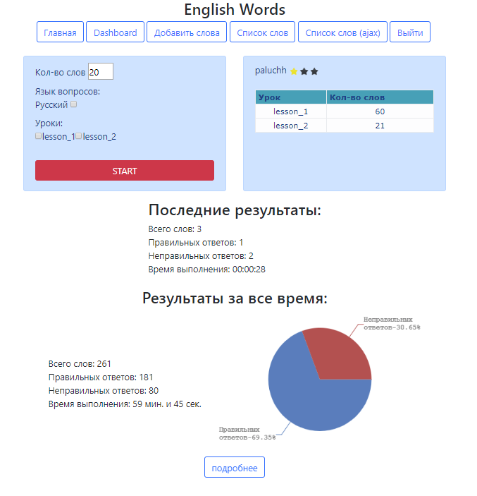
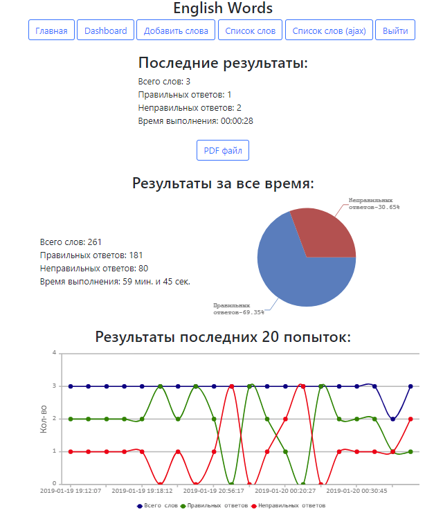
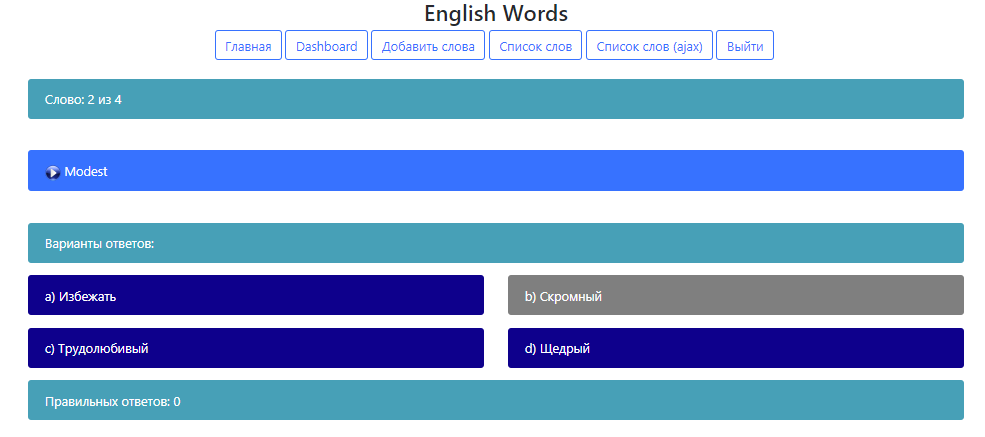
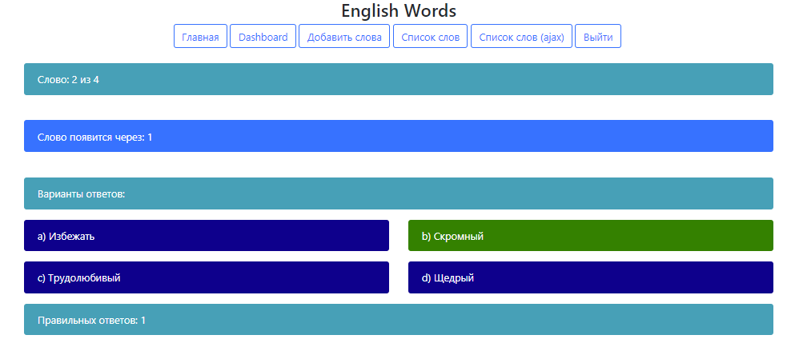

# engwo.loc
 <b>Задача:</b>
 Сделать WEB-приложение для проработки английских слов для изучения английского языка. 

 <b>Особенности:</b>
 Реализована возможность озвучивание слов;
 Предусмотрена возможность добавлять/редактировать/удалять слова;
 Результаты можно посмотреть в виде графика/диаграммы;
 Словарь слов можно скачать в формате PDF;
 Проверка слов происходит с помощью jQuery в форме викторины;
 Реализована возможность регистрации/смены пароля;

 <b>Установка:</b>
 Импортировать в БД файл - engwo.sql;
 Заполнить файл конфигурации входа в БД - \config\db.php;
 composer install;
 Зарегистрировать пользователя и ввести слова

 <b>Использовались пакеты:</b>
 <b>"duncan3dc/speaker"</b> - преобразование текста в речь;
 <b>"mpdf/mpdf"</b> - генерация PDF-файла из HTML;
 <b>"delight-im/auth"</b> - аутентификация;
 <b>"tamtamchik/simple-flash"</b> - флеш-уведомления для PHP;
 <b>"respect/validation"</b> - механизм валидации;
 <b>"swiftmailer/swiftmailer"</b> - PHP-почтовик;

 

 

 

 

